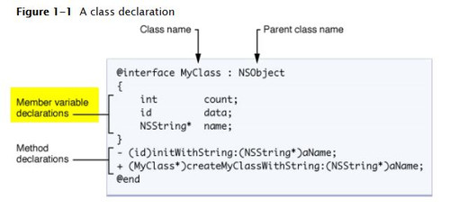

# OC 语言特性

## OC 基础知识


###  1. 成员变量 实例变量 属性



图中的**Member Variable declarations**翻译过来就是**成员变量的声明**

```objective-c
类： Class (description/template for an object)
实例： Instance (manifestation of a class)
消息： Message (sent to object to make it act)
方法： Method (code invoked by a Message)
实例变量： Instance Variable (object-specific storage)
超类/子类： Superclass/Subclass (Inheritance)
协议：  Protocol (non-class-specific methods)
```

从给出的英文说明，可以看出：实例（Instance）是针对 类（class）而言的。实例是指类的声明；由此推理，实例变量（Instance Variable） 是指**由类声明的对象**。

 严格说来，上图中的  int  count;  是一个成员变量。

而 `NSString name；` 是一个实例变量（NSString是一个类）。

 至于 id data 应该属于成员变量还是实例变量呢？  因为 id 是 OC特有的类型。从本质上讲， id 等同于 （void *）。 所以 id data 应属于 实例变量。

**成员变量**：通常是指向对象或是基础类型（int, float）的简单指针。可以在.h 或是 .m 文件中声明：

**实例变量**：是成员变量的一种，实例是针对类而言的，是指对类的声明；由此推理，实例变量是指由类声明的对象。

**属性**：GCC 到 LLVM（low level virtual machine），编译器自动为属性添加成员变量，规则：_属性名。如果需要自定义成员变量的名字，可以使用@synthesizer实现。


### 2.分类

#### 2.1 特点

- 运行时决议 --- 比如一个数组类，在编好分类文件之后，并没有把分类当中对应添加的内容附加到相应的数组类，而是在运行时通过 runtime 真实的添加到数组类中
- 可以为系统类添加分类

#### 2.2分类都做了哪些事 

- 声明私有方法
- 分解体积庞大的类文件
- 把 Framework 的私有方法公开


#### 2.3 分类中都可以添加哪些内容

- 实例方法
- 类方法
- 协议
- 属性(不是添加实例变量，实例变量需要通过关联对象添加)

```objective-c
typedef struct category_t {
    const char *name;
    classref_t cls;
    struct method_list_t *instanceMethods; //实例方法列表
    struct method_list_t *classMethods;
    struct protocol_list_t *protocols;
    struct property_list_t *instanceProperties;
} category_t;
```


#### 2.4 加载调用栈

```objective-c
_objc_init
└──map_2_images
    └──map_images_nolock
        └──_read_images
            └──_remethodizeClass
```

- `_objc_init` 算是整个 objc 的入口，进行了一些初始化操作，注册了镜像状态改变时的回调函数
- `map_2_images` 主要是加锁并调用 `map_images_nolock` ，加载内存镜像相关内容
- `map_images_nolock` 在这个函数中，完成所有 class 的注册、fixup等工作，还有初始化自动释放池、初始化 side table 等工作并在函数后端调用了 `_read_images`
- `_read_images` 方法干了很多苦力活，比如加载类、Protocol、Category，加载分类的代码就写在 `_read_images` 函数的尾部

分类被附加到类上是在map_images的时候发生的。

首先拿到`category_t`数组 (获得所有`Category`文件)

1. 把category的实例方法、协议以及属性添加到类上
2. 把category的类方法和协议添加到类的metaclass上

把所有`category`的实例方法列表拼成了一个`大的实例方法列表`，然后转交给了attachMethodLists方法(方法，扩展也类似)


```objective-c
for (uint32_t m = 0;
             (scanForCustomRR || scanForCustomAWZ)  &&  m < mlist->count;
             m++)
        {
            SEL sel = method_list_nth(mlist, m)->name;
            if (scanForCustomRR  &&  isRRSelector(sel)) {
                cls->setHasCustomRR();
                scanForCustomRR = false;
            } else if (scanForCustomAWZ  &&  isAWZSelector(sel)) {
                cls->setHasCustomAWZ();
                scanForCustomAWZ = false;
            }
        }

        // Fill method list array
        newLists[newCount++] = mlist;
    .
    .
    .

    // Copy old methods to the method list array
    for (i = 0; i < oldCount; i++) {
        newLists[newCount++] = oldLists[i];
    }


```

所谓的方法覆盖，原有的方法并没有消失，只是他在方法列表中的索引后于分类中的方法。而运行时方法查找是顺着方法列表顺序查找的。所以如果要调原方法也很简单，顺着方法列表找到最后一个对应名字的方法就是原方法。

以分类方法为例，类中的方法数组是一个二维数组，结构如下:

```objective-c
//二维数组
[[method_t,method_t],[method_t],[method_t,method_t],...];

//外围中括号指的是类方法列表数组
//内部多个中括号只分类中的Method方法合并到类中的数组
//代理等也是这个数据结构
```


#### 2.5  Category 和 +load

1. 在类的+load方法调用的时候，我们可以调用category中声明的方法么？

可以调用，因为附加category到类的工作会先于+load方法的执行(指"替换"原类方法)

2. 这么些个+load方法，调用顺序是咋样的呢？

+load的执行顺序是先类，后category，而category的+load执行顺序是根据编译顺序决定的。


- load方法的调用顺序有两条规则:父类先于子类调用，类先于分类调用。
- 那么，在多个分类的情况下呢？取决于编译器中的compile sources中的顺序。而后编译的，在"同名覆盖"的情况下，方法会先被找到。


#### 2.5 总结

（1）分类添加的办法可以“覆盖”原类办法，实则各个类别的办法依然存在办法列表中。

（2）同名分类办法谁能生效取决于编译顺序

（3）名字相同的分类会引起编译报错

### 3. 关联对象

#### 3.1 意义

顾名思义，就是把一个对象关联到另外一个对象身上。使两者能够产生联系。

使用场景:

- 运行时给cagetory添加getter和setter。因为category中添加的property不会生成带下划线"_"的成员变量以及getter和setter的实现。所以可以通过关联对象实现getter和setter。**(主要)**
- 有时需要在对象中存储一些额外的信息，我们通常会从对象所属的类中继承一个子类。然后给这个子类添加额外的属性，改用这个子类。然而并非所有的情况都能这么做，有时候类的实例可能是由某种机制创建的，而开发者无法另这种机制创建出自己所写的子类实例。此时可以使用“关联对象”。
- 有时只是给某个类添加一个额外的属性，完全没有必要继承出来一个子类。此时可以使用“关联对象”。
- delegate回调的方法中使用关联对象。有时候在一些delegate回调的方法中需要处理一些回调任务。比如发起网络请求和在delegate回调的方法中做UI的更新。这样一来，发起网络请求和在回调中更新UI的代码被分散到了两个地方，不利于管理和阅读。此时可以使用“关联对象”。

#### 3.2 重要函数

```objective-c
id objc_getAssociatedObject(id object , const void *key)

void objc_setAssociatedObject(id object,const void *key,id value, objc_AssociationPolicy policy)

void objc_removeAssociatedObject(id object)

```


#### 3.3 关联对象本质

- 关联对象由 `AssociationsManager` 管理并在 `AssiciationsHashMap` 存储。
- 所有对象的关联内容都在同一个全局容器中。


- 关联对象的释放时机与移除时机并不总是一致，比如实验中用关联策略 **OBJC_ASSOCIATION_ASSIGN** 进行**关联的对象**，很早就已经被释放了，但是并没有被移除，而再使用这个关联对象时就会造成 Crash 。[注意是用Assign关联对象(@property中用assign也会导致崩溃)]

###  3. 扩展

> A class extension bears some similarity to a category, **but it can only be added to a class for which you have the source code** at compile time (the class is compiled at the same time as the class extension). The methods declared by a class extension are implemented in the `@implementation` block for the original class so you can’t, for example, declare a class extension on a framework class, such as a Cocoa or Cocoa Touch class like `NSString`.
>
> //引用自苹果
>
> //重点核心意思:与分类相似，但是只能被添加到有源码的类文件中

```objective-c
//implementation file (.m) 
//.m文件中实现
@interface ClassName ()
 
@end
```

一般用扩展做什么

- 声明私有属性
- 声明私有方法
- 声明私有成员变量

扩展的特点 (和分类的区别)

- 编译时决议(内存结构规定后无法修改)
- 只以声明的形式存在，多数情况下寄生于宿主类的.m中(即需要源码)
- 不能为系统类添加扩展

####  4.代理

- 准确的说是一种软件设计模式
- iOS当中以@protocol形式体现
- 传递方式一对一
- 一般声明为weak以规避循环引用


代理方:主动

委托方:被动

代理的实现流程:


###  5.通知

- 是使用**观察者模式**来实现用于跨层传递消息的机制
- 传递方式为一对多

如何实现通知机制？（没有源代码）


###  6.KVO

**Q:什么是KVO？**

**A:** OC 对观察者模式的又一实现； Apple 使用了 **isa 混写**(isa-swizzling) 来实现KVO.


当调用了 `addObserver:forkeypath`方法之后，系统会动态创建 `NSKVONorifying_A`类，同时将A的isa指针指向 NSKVONorifying_A。

iOS中`KVO`分为自动监听和手动触发两种形式

手动触发:

1. 重写监听属性的set、get方法
2. 重写 `+ (BOOL)automaticallyNotifiesObserversForKey:(NSString *)key` 
3. 在set方法中在赋值的前后分别调用：`willChangeValueForKey`和`didChangeValueForKey`
4. 实现`willChangeValueForKey`和`didChangeValueForKey`方法

其中需要重写

```objective-c
+ (BOOL)automaticallyNotifiesObserversForKey:(NSString *)key{
  if([key isEqualToString:@"age"]){
  //取消自动发送通知
    return NO;
  }else{
    return [super automaticallyNotifiesObserversForKey:key];
  }
}
```


### 7.KVC

是一种键值对设计模式，破坏面对对象的编程思想。(不重写特定方法,找不到Key情况下会崩溃)

主要方法

```objective-c
-(id)valueForKey:(NSString *)key
-(void)setValue:(id)value forked:(NSString *)key;
```


寻找路径

`setterKey(keySet方法)` -> `_key` -> `_isKey` -> `key` -> `iskey`


## 

**KVC setvalue:forkey与setvalue:forkeypath的区别**:

`forkey`用于简单路径,`forkeypath`用于复合路径(比如key是对象，可以直接赋值给这个对象的属性.eg:`setValue:@100 forKeyPath:@"person.number"`)


### 8.属性关键字

读写权限

- readonly
- readwrite      √默认关键字

引用计数

- retain / strong

- weak / assign

  assign:

  修饰基本数据类型，如int, bool等

  修饰对象类型时，不改变其引用计数

  会产生悬垂指针：仍然指向内存地址，如果没覆盖后还调动变量就会crash

  weak：

  不改变修饰对象的引用计数

  所指对象在释放之后会自动设置为nil

- copy

| name       | 浅拷贝 | 深拷贝 |
| ---------- | ------ | ------ |
| 新内存空间 | 不分配 | 分配   |
| 引用计数   | 影响   | 不影响 |


| 源对象类型    | 拷贝方式    | 目标对象类型 | 拷贝类型 |
| ------------- | ----------- | ------------ | -------- |
| mutable对象   | copy        | 不可变       | 深拷贝   |
| mutable对象   | mutableCopy | 可变         | 深拷贝   |
| immutable对象 | copy        | 不可变       | 浅拷贝   |
| immutable对象 | mutableCopy | 可变         | 深拷贝   |

原子性

- atomic     √默认关键字
- nonatomic

atomic` 保证赋值获取是线程安全,是对成员属性的直接的获取安全，并不代表操作和访问安全.`
比如 `atomic` 修饰的是一个数组,对数组**赋值获取**是安全的，但是对数组**进行操作**(添加对象，移除对象)是不保证线程不安全的.而且采用`atomic`消耗比较大

```objective-c
array = [[NSArray alloc]init];	//安全
[array addobject:obj];	//也会存在不安全
```


### 9.常见问题

#### 1.retain和strong

都是强引用，除了某些情况下不一样，比如修饰block，其他的时候也是可以通用的。


#### 2.深拷贝浅拷贝


#### 3.copy返回的都是不可变对象

```objective-c
//提问， 这样写有什么问题 ?
@property(copy)NSMutableArray *array?
```

无论复制过来的是可变还是不可变对象，都是NSArray，当调用方调用 Array 的添加对象和移除对象等操作，对于不可变 Array 就会产生程序异常

## Reference

[1. 面试驱动技术 - Category 相关考点(Article文件夹有收藏)](https://juejin.im/post/5c753bc251882505d52fba5c)

