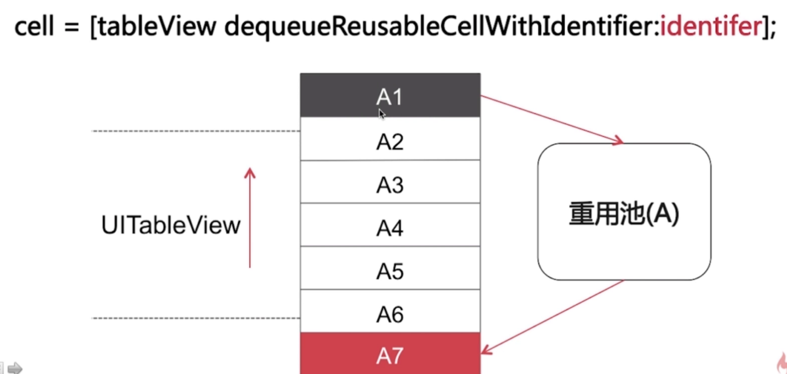
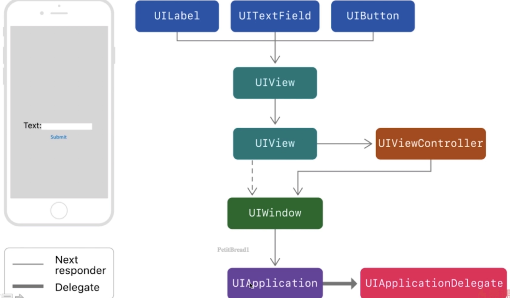
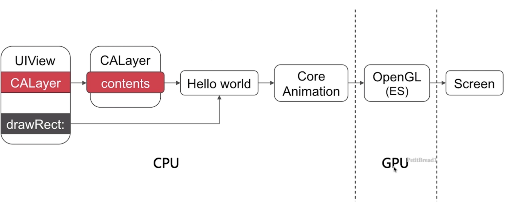

# UI

## List

<a href="#UI Foundation">1. UI基础要点</a>

## UI基础
<a id="UI Foundation">

## 1. UITableView/UICollectionView

### 1.1 重用机制

一般会通过重用cell来达到节省内存的目的:通过为每个cell指定一个重用标识符(reuseIdentifier),即指定了单元格的种类,当cell滚出屏幕时,会将滚出屏幕的单元格放入重用的缓存池中，当某个未在屏幕上的单元格要显示的时候，就从这个缓存池中取出单元格进行重用。




### 1.2  数据源同步

如何解决tableView在多线程的情况下修改或者访问数据源的一个同步问题?

- 并发访问 & 数据拷贝
- 串行访问


## 2.UI事件传递和响应

### CALayer 与 UIView

- UIView 为CALayer提供内容，专门负责处理触摸等事件，参与响应链
- CALayer 全权负责显示内容 contents
- 单一原则，设计模式（负责相应的功能）

### 事件传递

 ```objective-c
- (UIView *)hitTest:(CGPoint)point withEvent:(UIEvent *)event
//返回最终响应的事件
    //指定想要响应事件的 View, 比如点击的是 A ，可以指派 B 来响应。
- (BOOL)pointInside:(CGPoint)point withEvent:(UIEvent *)event
//判断点击位置是否在当前范围内
    //控制响应的范围，扩大 or 缩小。
 ```


- 首先判断当前视图 !hidden &$ userInteractionEnable && alpha > 0.01 条件通过的时候，到下一步.   否则返回nil，找不到当前视图
- 通过 pointInside 判断点击的点是否在当前范围内，为YES直接下一步.  不在则直接返回nil。
- `倒序遍历`所有子视图，同时调用 hitTest 方法，如果某一个子视图返回了对应的响应视图，这个子视图会直接作为最终的响应视图给响应方，如果为 nil 则继续遍历下一个子视图。如果全部遍历结束都返回nil，那会返回当前点击位置在当前的视图范围内的视图作为最终响应视图.......

当我们点击屏幕时候的事件传递

```objective-c
UIApplication -> UIWindow -> hitTest:withEvent:
```


### 视图响应链 (注意和事件传递是倆概念)




## 3 图像显示原理




CPU和GPU通过总线连接，CPU中计算出的往往是bitmap位图，通过总线由合适的时机传递给GPU，GPU拿到位图后，渲染到帧缓存区FrameBuffer,然后由视频控制器根据vsync信号在指定时间之前去帧缓冲区提取内容，显示到屏幕上。


`CPU工作内容: `layout（UI布局，文本计算），display（绘制 drawRect）,prepare(图片解码)，commit（提交位图）

`GPU工作内容:` 顶点着色，图元装配，光栅化，片段着色，片段处理，最后提交帧缓冲区

