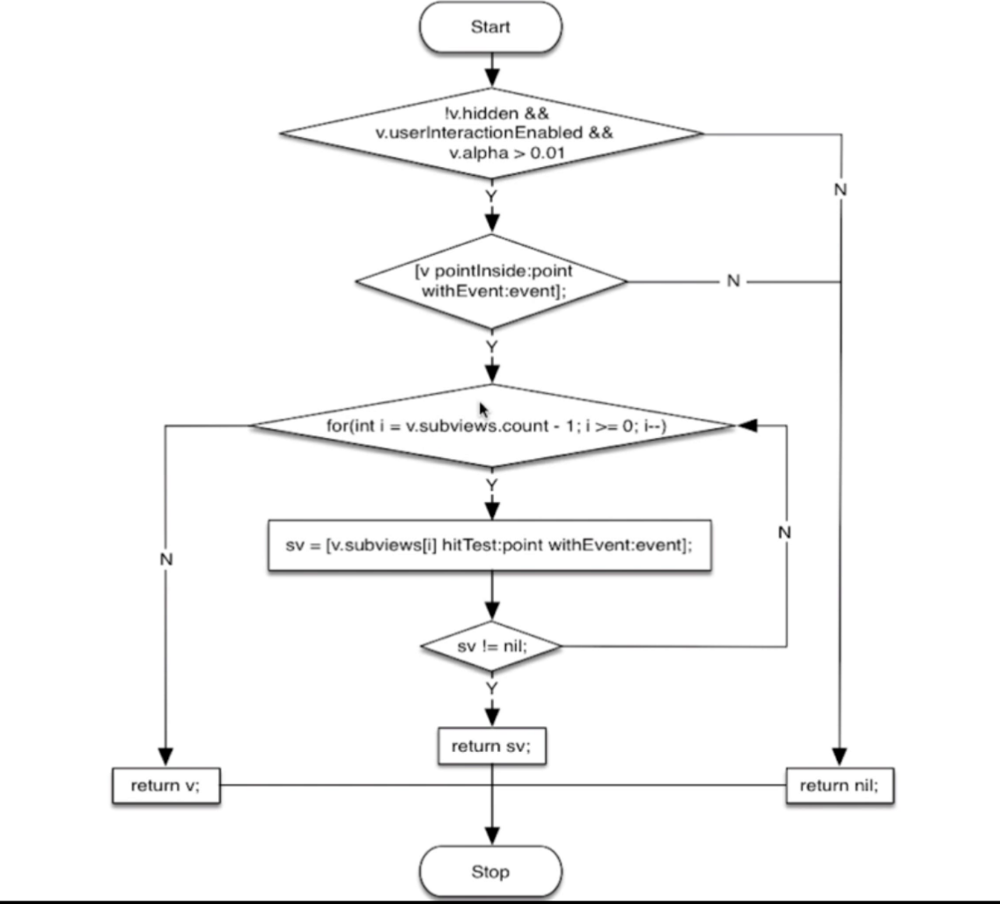
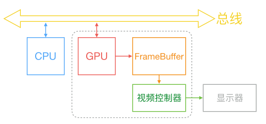
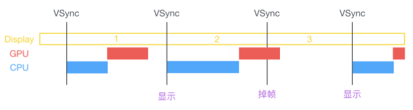
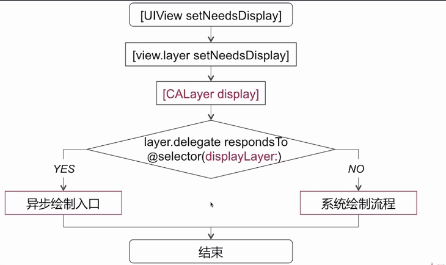
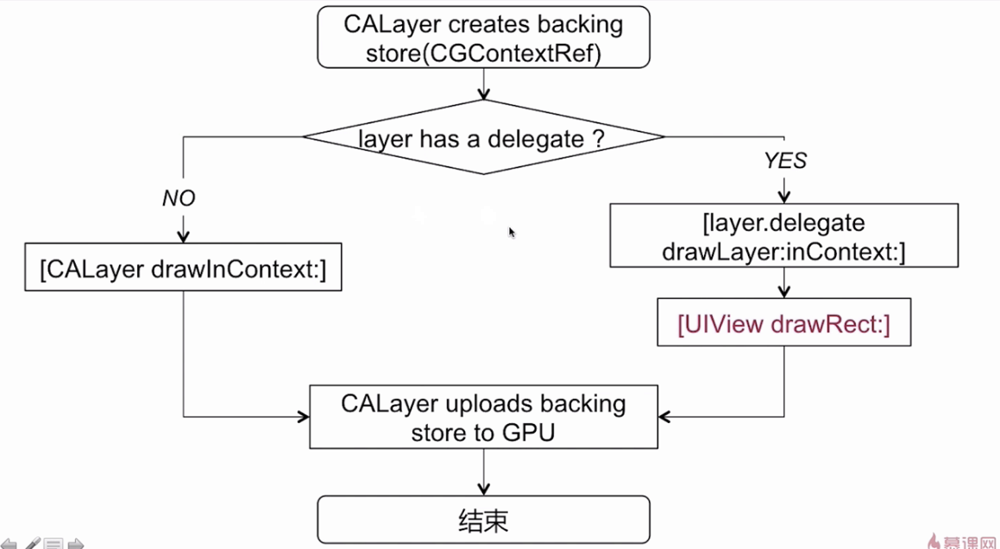
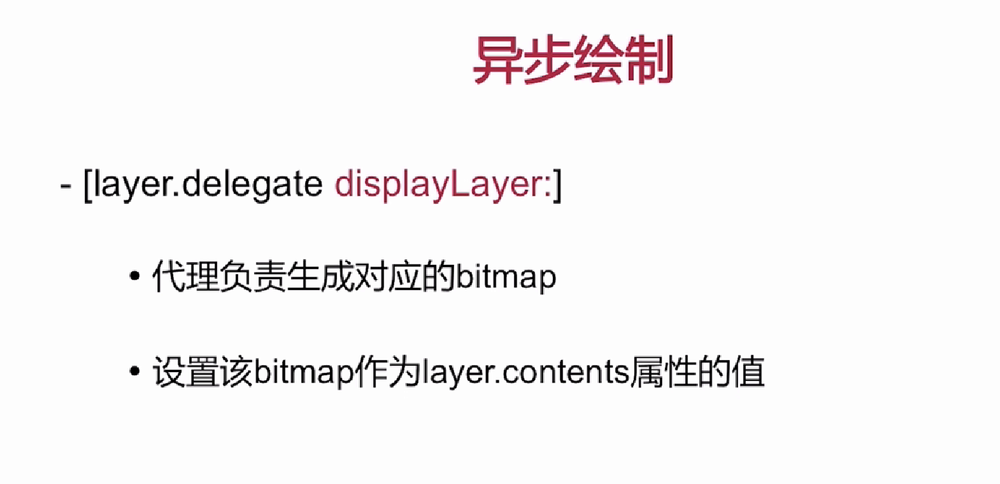
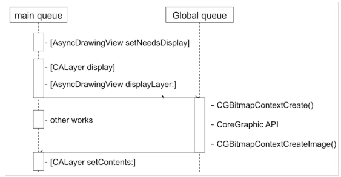

# UI

## List

<a href="#UI Foundation">1. UI基础要点</a>

## UI基础
<a id="UI Foundation">

## 1. UITableView/UICollectionView

### 1.1 重用机制

一般会通过重用cell来达到节省内存的目的:通过为每个cell指定一个重用标识符(reuseIdentifier),即指定了单元格的种类,当cell滚出屏幕时,会将滚出屏幕的单元格放入重用的缓存池中，当某个未在屏幕上的单元格要显示的时候，就从这个缓存池中取出单元格进行重用。


### 1.2  数据源同步

如何解决tableView在多线程的情况下修改或者访问数据源的一个同步问题?

- 并发访问 & 数据拷贝
- 串行访问


## 2.UI事件传递和响应

### CALayer 与 UIView

- UIView 为CALayer提供内容，专门负责处理触摸等事件，参与响应链
- CALayer 全权负责显示内容 contents
- 单一原则，设计模式（负责相应的功能）

### 事件传递

 ```objective-c
- (UIView *)hitTest:(CGPoint)point withEvent:(UIEvent *)event
//返回最终响应的事件
    //指定想要响应事件的 View, 比如点击的是 A ，可以指派 B 来响应。
- (BOOL)pointInside:(CGPoint)point withEvent:(UIEvent *)event
//判断点击位置是否在当前范围内
    //控制响应的范围，扩大 or 缩小。
 ```




- 首先判断当前视图 !hidden &$ userInteractionEnable && alpha > 0.01 条件通过的时候，到下一步.   否则返回nil，找不到当前视图
- 通过 pointInside 判断点击的点是否在当前范围内，为YES直接下一步.  不在则直接返回nil。
- `倒序遍历`所有子视图，同时调用 hitTest 方法，如果某一个子视图返回了对应的响应视图，这个子视图会直接作为最终的响应视图给响应方，如果为 nil 则继续遍历下一个子视图。如果全部遍历结束都返回nil，那会返回当前点击位置在当前的视图范围内的视图作为最终响应视图.......

当我们点击屏幕时候的事件传递

```objective-c
UIApplication -> UIWindow -> hitTest:withEvent:
```


### 视图响应链 (注意和事件传递是倆概念)


## 3 图像显示原理




CPU和GPU通过总线连接，CPU中计算出的往往是bitmap位图，通过总线由合适的时机传递给GPU，GPU拿到位图后，渲染到帧缓存区FrameBuffer,然后由视频控制器根据vsync信号在指定时间之前去帧缓冲区提取内容，显示到屏幕上。


`CPU工作内容: `layout（UI布局，文本计算），display（绘制 drawRect）,prepare(图片解码)，commit（提交位图）

`GPU工作内容:` 顶点着色，图元装配，光栅化，片段着色，片段处理，最后提交帧缓冲区

### 3.1  UI 卡顿、掉帧原理




在规定的16.7ms内，在下一个VSync信号到来之前，CPU和GPU并没有共同完成下一帧视频的合成，就会出现掉帧、卡顿。

##### 滑动优化方案思路：

- CPU：
   1.对象的创建、调整、销毁可以放在子线程中去做ASDK；
   2.预排班。布局计算、文本计算等事先放到子线程中去做；
   3.使用轻量级对象，比如CALayer代替UIView
   4.预渲染。文本等异步绘制，图片编解码等。
   5.控制并发线程数量
   6.减少重复计算布局，减少修改frame等
   7.autolayout比frame更消耗资源
   8.可以让图片的size跟frame一致
- GPU：
   1.纹理渲染。避免离屏渲染
   2.视图混合。减少视图层级的复杂性，减少透明视图；不透明的opaque设置为YES
   3.GPU能处理的最大纹理是4096 * 4096，一旦超过这个尺寸就会调用CPU进行资源处理，所以纹理尽量不要超过这个尺寸


### 4.UIView的绘制原理



`[UIView setNeedsDisplay]` 并没有发生当前视图立即绘制工作,打上需要重绘的脏标记，最后是在某个时机完成

`[UIView setLayoutIfNeed]` 立即重新布局视图

当我们调用UIView的`setNeedsDisplay`的方法时候，会调用`layer`的同名方法，相当于在当前`layer`打上绘制标记，在当前`runloop`将要结束的时候，才会调用CALayer的`display`方法进入到真正的绘制当中。

CALayer的`display`方法中，首先会判断layer的delegate方法`displayLayer：`是否实现，如果代理没有响应这个方法，则进入到系统绘制流程；如果代理响应了这个方法，则进入到异步绘制流程 

#### 4.1系统绘制流程




在CALayer内部，系统会创建一个backingStore（可以理解为CGContextRef，drawRect中取到的currentRef就是这个东西），然后layer回判断是否有delegate，如果没有代理，就调用CALayer的`drawInContext：`方法；如果有代理，则调用layer代理的`drawLayer:inContext:`方法，这一步发生在系统内部，然后在合适的时间给与我们回调一个熟悉的UIView的`drawRect：`方法。也就是在系统内部的绘制之上，允许我们再做一些额外的绘制。最后CALayer把backting store（位图）传给GPU。


#### 4.2 异步绘制流程



layer的delegate如果实现了`displayLayer:`方法，就会进入到异步绘制的流程。在异步绘制的过程中，需要代理来生成对应的bitmap位图文件，并把此bitmap作为layer的contents属性




#### 4.3 离屏渲染

当设置某些UI图层属性时候，如果指定为被未预合成之前，不能直接显示在屏幕上的时候，就触发了离屏渲染。离屏渲染是基于GPU层面上的，指GPU在当前屏幕缓冲区外开辟了一个缓冲区，进行渲染操作。

##### 何时会触发离屏渲染：

- 设置图层圆角的时候，且跟maskToBounds或者clipToBounds同时使用；
- 设置图层蒙版
- 阴影
- 光栅化

##### 为何要避免离屏渲染?

离屏渲染发生在GPU层面上，因为离屏渲染使GPU触发Opengl多通道渲染管线，产生额外开销，所以要避免。 在触发离屏渲染时候，会增加GPU工作量，增加GPU工作量，可能会导致GPU和CPU工作耗时的总耗时超出Vsync信号时间，导致UI卡顿或者掉帧。